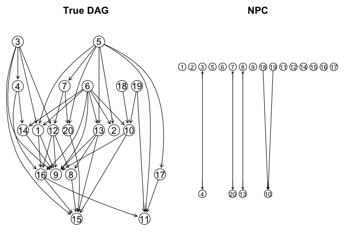
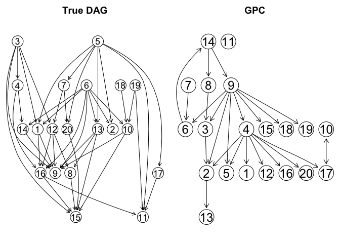
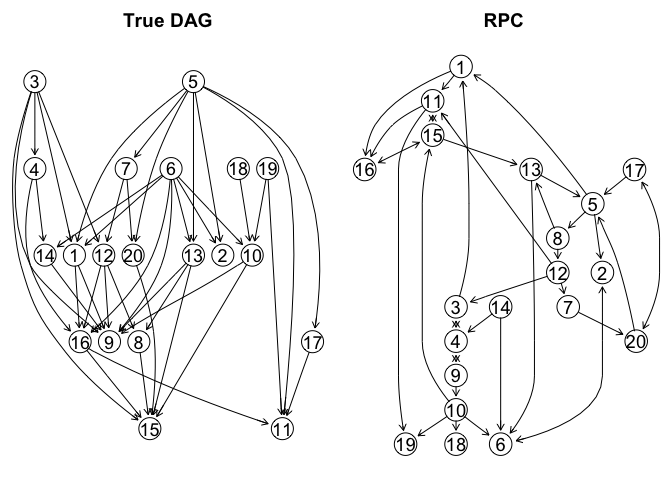
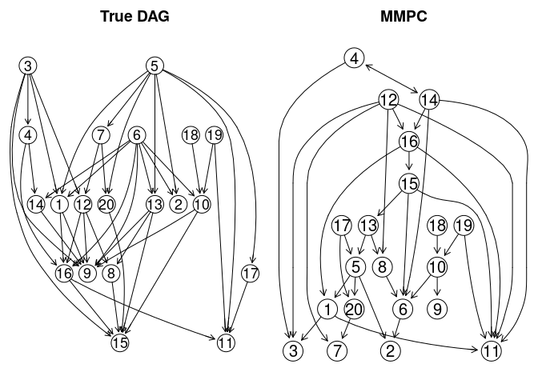
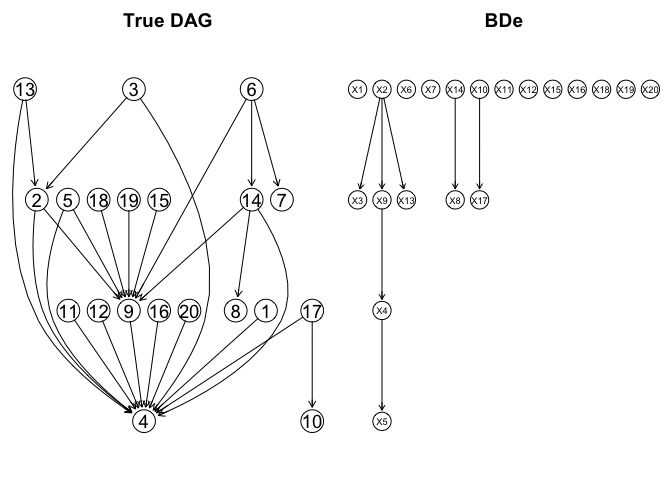
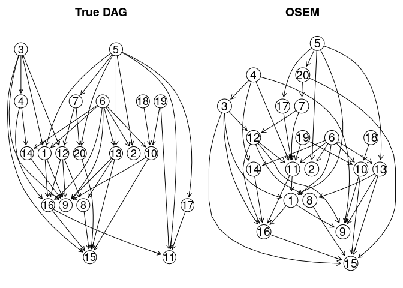

### 1. Load necessary packages and source code

``` r
library(BiDAG)
library(Rgraphviz)
library(pcalg)
library(graph)
library(bnlearn)
library(MXM)
library(sbgcop)
library(infotheo)
library(rpcart)
library(devtools)
#source_url("https://raw.githubusercontent.com/cuiruifei/CausalMissingValues/master/R/gaussCItestLocal.R")
source_url("https://raw.githubusercontent.com/cuiruifei/CausalMissingValues/master/R/inferCopulaModel.R")
#source_url("https://raw.githubusercontent.com/cuiruifei/CausalMissingValues/master/R/addMAR.R")
```

``` r
setwd("../R")
# Major file containing the OSEM algorithm
source("ordinalScore.R") 
# Modify some of the existing functions in the BiDAG package to accommodate our user-defined functions
insertSource("spacefns.R",package = "BiDAG")
insertSource("usrscorefns.R",package = "BiDAG")
```

### 2. Other functions

``` r
##' rmvDAG2(N, randDAGobj): 
##' a function that does the same thing as the pcalg::rmvDAG function
##' but the input DAG is not necessarily topologically ordered
##' @param N: number of samples to be drawn
##' @param randDAGobj: a graph object generated from the pcalg::randDAG function
##' @return a Gaussian dataset
rmvDAG2 <- function(N, randDAGobj) {
  AM <- as(randDAGobj, "matrix")
  sorted_ind <- ggm::topOrder((AM != 0))
  n <- nrow(AM)
  data <- matrix(nrow = N,ncol = n)
  for (j in sorted_ind) {
    parentnodes <- which(AM[,j] != 0)
    lp <- length(parentnodes)
    switch (as.character(lp),
            "0" = {data[,j] <- rnorm(N)},
            "1" = {data[,j] <- rnorm(N, mean = data[,parentnodes] * AM[parentnodes,j], sd = 1)},
            {data[,j] <- rnorm(N, mean = data[,parentnodes] %*% AM[parentnodes,j], sd = 1)}
    )
  }
  return(data)
}
```

``` r
##' cutfun(L, c): 
##' a function that simulates the cell probabilities from a symmetric Dirichlet distribution
##' @param L: number of ordinal levels
##' @param c: Dirichlet concentration parameter
##' @return a list of probabilities of length L, summing up to 1
cutfun <- function(L,c) {
  p <- gtools::rdirichlet(1,rep(c,L))
  return(qnorm(cumsum(p)[1:(L-1)]))
}
```

``` r
##' convertToOrdinal(scaled_data, exp_levels, concent_param): 
##' a function that converts standardized Gaussian data into ordinal data
##' @param scaled_data: Gaussian dataset with each dimension standardized
##' @param exp_levels: expected number of ordinal levels
##' @param concent_param: Dirichlet concentration parameter
##' @return an ordinal dataset
convertToOrdinal <- function(scaled_data, exp_levels = 4,concent_param = 2) {
  n <- ncol(scaled_data)
  if (exp_levels == 2) {
    ordinal_levels <- replicate(n,2)
  } else {
    ordinal_levels <- replicate(n,sample(c(2:(2 * exp_levels - 2)),1))
  }
  ordinal_data <- scaled_data
  for (i in c(1:n)) {
    
    check_levels <- ordinal_levels[i] - 1
    while (check_levels != ordinal_levels[i]) {
      cuts <- c(-Inf, 
                cutfun(ordinal_levels[i],concent_param), 
                Inf)
      temp <- cut(scaled_data[,i], simplify2array(cuts), labels = FALSE) - 1
      check_levels <- length(unique(temp))
    }
    ordinal_data[,i] <- temp
    
  }
  colnames(ordinal_data) <- c(1:n)
  return(ordinal_data)
}
```

``` r
##' catCItest(x, y, S, suffStat): 
##' a helper function for categorical tests to be consumed by the pcalg::pc function
##' @param x,y,S: position of variable X, Y and set of variables S, respectively, in the adjacency matrix
##' @param suffStat: sufficient statistics for the test
##' @return p-value of the categorical tests
catCItest <- function(x, y, S, suffStat) {
  # d <- as.data.frame(suffStat$data)
  # d[] <- lapply(d[], as.ordered)
  return(gRim::ciTest_ordinal(suffStat$data,
                              set = as.numeric(c(x,y,S)),
                              statistic = suffStat$stat_type)$P)
}
```

``` r
##' mywFUN(m): 
##' a function that samples the edge weights uniformly from the interval (-1,-0.4) U (0.4,1)
##' @param m: number of edges in the DAG
##' @return m edge weights
mywFUN <- function(m) {
  return(replicate(m,mywFUNhelper()))
}
mywFUNhelper <- function() {
  y <- runif(1, 0, 1.2)
  if( y < 0.6 ){
    x <- -1 + y
  }else{
    x <- 0.4 + y - 0.6
  }
  return(x)
}
```

### 3. Generate DAGs and ordinal data

``` r
set.seed(888)
# Generate a regular DAG with 20 nodes with 4 number of neighbors
n <- 20
trueDAG <- randDAG(n = n, d = 4, method = "er", wFUN = list(mywFUN))

# Generate a Gaussian dataset based on the DAG and standardize each dimension
# Sample size = 500
N <- 500
hidden_data <- rmvDAG2(N, trueDAG)
truecov <- trueCov(trueDAG)
D <- diag(sqrt(diag(truecov)))
D.inv <- chol2inv(chol(D))
trueSigma <- D.inv %*% truecov %*% D.inv
scaled_data <- t(D.inv %*% t(hidden_data))

# Convert the Gaussian dataset into an ordinal dataset
ordinal_data <- convertToOrdinal(scaled_data, exp_levels = 4,concent_param = 2)
ordinal_data_df <- as.data.frame(ordinal_data)
ordinal_data_df[] <- lapply(ordinal_data_df[], as.ordered)
```

### 4. Learn the structures using different methods

The following simulations can be repeated many times for different
configurations of parameters in order to obtain the ROC curves.

-   NPC

``` r
# NPC algorithm with the nominal deviance test (significance level: 0.05)
NPCfit <- pc(suffStat = list(data = ordinal_data_df, stat_type = "dev"),
             alpha = 0.05,
             indepTest = catCItest,
             labels = colnames(ordinal_data))
# NPC algorithm with the G^2 test (significance level: 0.05)
NPCfit <- pc(suffStat = list(dm = ordinal_data, 
                             nlev = apply(ordinal_data, 2, function (x) length(unique(x))),
                             adaptDF = FALSE),
             alpha = 0.05,
             indepTest = disCItest,
             labels = colnames(ordinal_data))
# NPC algorithm with the Pearson X^2 test (significance level: 0.05)
NPCfit <- amat(pc.stable(ordinal_data_df, alpha = 0.05, test = "x2"))
# NPC algorithm with the mutual information (significance level: 0.05)
NPCfit <- amat(pc.stable(ordinal_data_df, alpha = 0.05, test = "mi"))
```



``` r
# Compare the patterns between them
comparePatterns(NPCfit,trueDAG) # hard version
```

    ##       SHD        TP        FP        TN        FN Precision       TPR     FPR_N 
    ##     38.00      4.00      1.00    148.00     37.00      0.80      0.10      0.01 
    ##     FPR_P 
    ##      0.02

``` r
comparePatterns(NPCfit,trueDAG,hardP2P = FALSE) # soft version
```

    ##       SHD        TP        FP        TN        FN Precision       TPR     FPR_N 
    ##     37.50      4.50      0.50    148.00     37.00      0.90      0.11      0.00 
    ##     FPR_P 
    ##      0.01

-   OPC (Musella, 2013)

``` r
# OPC algorithm with the ordinal Jonckheere–Terpstra test (significance level: 0.05) (gRim implementation)
OPCfit <- pc(suffStat = list(data = ordinal_data_df, stat_type = "jt"),
             alpha = 0.05,
             indepTest = catCItest,
             labels = colnames(ordinal_data))
# OPC algorithm with the ordinal Jonckheere–Terpstra test (significance level: 0.05) (bnlearn implementation)
OPCfit <- amat(pc.stable(ordinal_data_df, alpha = 0.05, test = "jt"))
```


``` r
# Compare the patterns between them
comparePatterns(OPCfit,trueDAG) # hard version
```

    ##       SHD        TP        FP        TN        FN Precision       TPR     FPR_N 
    ##     37.00     13.00     18.00    140.00     19.00      0.42      0.31      0.12 
    ##     FPR_P 
    ##      0.43

``` r
comparePatterns(OPCfit,trueDAG,hardP2P = FALSE) #soft version
```

    ##       SHD        TP        FP        TN        FN Precision       TPR     FPR_N 
    ##     35.00     15.00     16.00    140.00     19.00      0.48      0.36      0.11 
    ##     FPR_P 
    ##      0.38

-   GPC

``` r
# GPC algorithm with the Gaussian test (significance level: 0.05)
GPCfit <- pc(suffStat = list(C = cor(ordinal_data), n = N),
             alpha = 0.05,
             indepTest = gaussCItest,
             labels = colnames(ordinal_data))
```



``` r
# Compare the patterns between them
comparePatterns(GPCfit,trueDAG) # hard version
```

    ##       SHD        TP        FP        TN        FN Precision       TPR     FPR_N 
    ##     35.00     16.00     20.00    139.00     15.00      0.44      0.38      0.14 
    ##     FPR_P 
    ##      0.48

``` r
comparePatterns(GPCfit,trueDAG,hardP2P = FALSE) # soft version
```

    ##       SHD        TP        FP        TN        FN Precision       TPR     FPR_N 
    ##     33.50     17.50     18.50    139.00     15.00      0.49      0.42      0.12 
    ##     FPR_P 
    ##      0.44

-   RPC (Harris and Drton, 2013; Cui et al., 2018)

``` r
corr.rank <- sin(pi/2 * cor(ordinal_data, use = 'pairwise.complete.obs', method = 'kendall'))
RPCfit <- pc(suffStat = list(C = corr.rank, n = N), 
             indepTest = gaussCItest, labels = colnames(ordinal_data), alpha = 0.05, conservative = T)
```



``` r
# Compare the patterns between them
comparePatterns(RPCfit,trueDAG) # hard version
```

    ##       SHD        TP        FP        TN        FN Precision       TPR     FPR_N 
    ##     31.00     17.00     15.00    142.00     16.00      0.53      0.40      0.10 
    ##     FPR_P 
    ##      0.36

``` r
comparePatterns(RPCfit,trueDAG,hardP2P = FALSE) # soft version
```

    ##       SHD        TP        FP        TN        FN Precision       TPR     FPR_N 
    ##     28.00     20.00     12.00    142.00     16.00      0.62      0.48      0.08 
    ##     FPR_P 
    ##      0.29

-   Copula PC (Cui et al., 2016, 2017, 2018)

``` r
# copula object
cop.obj <- inferCopulaModel(ordinal_data, nsamp = 1000, S0 = diag(n)/N, verb = F)
# correlation matrix samples
C_samples <- cop.obj$C.psamp[,, 501:1000]
# average correlation matrix
corr.cop <- apply(C_samples, c(1,2), mean)
# call the PC algorithm for causal discovery
CPCfit <- pc(suffStat = list(C = corr.cop, n = N), 
             indepTest = gaussCItest, labels = colnames(ordinal_data), alpha = 0.05, conservative = T)
```


``` r
# Compare the patterns between them
comparePatterns(CPCfit,trueDAG) # hard version
```

    ##       SHD        TP        FP        TN        FN Precision       TPR     FPR_N 
    ##     31.00     19.00     14.00    140.00     17.00      0.58      0.45      0.09 
    ##     FPR_P 
    ##      0.33

``` r
comparePatterns(CPCfit,trueDAG,hardP2P = FALSE) # soft version
```

    ##       SHD        TP        FP        TN        FN Precision       TPR     FPR_N 
    ##     30.50     19.50     13.50    140.00     17.00      0.59      0.46      0.09 
    ##     FPR_P 
    ##      0.32

-   MMPC (Tsagris et al., 2018)

``` r
skel <- pc.skel(ordinal_data_df, method = "comb.mm", alpha = 0.05)
MMDAG <- pc.or(skel)$G
MMDAG[MMDAG == 2] <- 1
MMDAG[MMDAG == 3] <- 0
```



``` r
# Compare the patterns between them
comparePatterns(MMDAG,trueDAG) # hard version
```

    ##       SHD        TP        FP        TN        FN Precision       TPR     FPR_N 
    ##     39.00     11.00     22.00    140.00     17.00      0.33      0.26      0.15 
    ##     FPR_P 
    ##      0.52

``` r
comparePatterns(MMDAG,trueDAG,hardP2P = FALSE) # soft version
```

    ##       SHD        TP        FP        TN        FN Precision       TPR     FPR_N 
    ##     35.50     14.50     18.50    140.00     17.00      0.44      0.35      0.12 
    ##     FPR_P 
    ##      0.44

-   BDe (Heckerman and Geiger, 1995)

``` r
# hybrid method with the BDe score and the nominal PC output as the initial search space
BDE <- scoreparameters("bdecat",data.frame(ordinal_data),bdecatpar = list(chi = 0.5))
BDEfit <- iterativeMCMC(BDE)
```



``` r
# Compare the patterns between them
comparePatterns(BDEfit$DAG,trueDAG) # hard version
```

    ##       SHD        TP        FP        TN        FN Precision       TPR     FPR_N 
    ##     41.00      3.00     15.00    146.00     26.00      0.17      0.07      0.10 
    ##     FPR_P 
    ##      0.36

``` r
comparePatterns(BDEfit$DAG,trueDAG,hardP2P = FALSE) # soft version
```

    ##       SHD        TP        FP        TN        FN Precision       TPR     FPR_N 
    ##     35.00      9.00      9.00    146.00     26.00      0.50      0.21      0.06 
    ##     FPR_P 
    ##      0.21

-   BGe (Heckerman and Geiger, 1995)

``` r
# hybrid method with the BGe score and the Gaussian PC output as the initial search space
BGE <- scoreparameters("bge", ordinal_data, bgepar = list(am = 0.5))
BGEfit <- iterativeMCMC(BGE,scoreout = TRUE)
```


``` r
# Compare the patterns between them
comparePatterns(BGEfit$DAG,trueDAG) # hard version
```

    ##       SHD        TP        FP        TN        FN Precision       TPR     FPR_N 
    ##     20.00     33.00     14.00    137.00      6.00      0.70      0.79      0.09 
    ##     FPR_P 
    ##      0.33

``` r
comparePatterns(BGEfit$DAG,trueDAG,hardP2P = FALSE) # soft version
```

    ##       SHD        TP        FP        TN        FN Precision       TPR     FPR_N 
    ##     19.50     33.50     13.50    137.00      6.00      0.71      0.80      0.09 
    ##     FPR_P 
    ##      0.32

-   OSEM

``` r
# the OSEM algorithm
OSEMfit <- ordinalStructEM(n, ordinal_data,
                           usrpar = list(penType = "other",
                                         L = 5,
                                         lambda = 3))
```



``` r
# Compare the patterns between them
comparePatterns(OSEMfit$DAG,trueDAG) # hard version
```

    ##       SHD        TP        FP        TN        FN Precision       TPR     FPR_N 
    ##     16.00     34.00      9.00    140.00      7.00      0.79      0.81      0.06 
    ##     FPR_P 
    ##      0.21

``` r
comparePatterns(OSEMfit$DAG,trueDAG,hardP2P = FALSE) # soft version
```

    ##       SHD        TP        FP        TN        FN Precision       TPR     FPR_N 
    ##     16.00     34.00      9.00    140.00      7.00      0.79      0.81      0.06 
    ##     FPR_P 
    ##      0.21

-   pcart (Talvitie et al., 2019)

``` r
setwd("../R")
insertSource("usrscorefns_pcart.R",package = "BiDAG")
```

``` r
pcartparam <- scoreparameters("usr", ordinal_data_df)
pcartfit <- iterativeMCMC(pcartparam, scoreout = TRUE)
```

``` r
# Compare the patterns between them
comparePatterns(pcartfit$DAG,trueDAG) # hard version
comparePatterns(pcartfit$DAG,trueDAG,hardP2P = FALSE) # soft version
```
