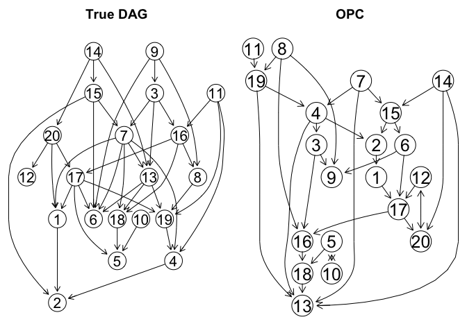
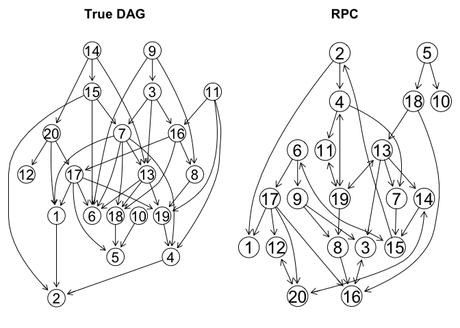
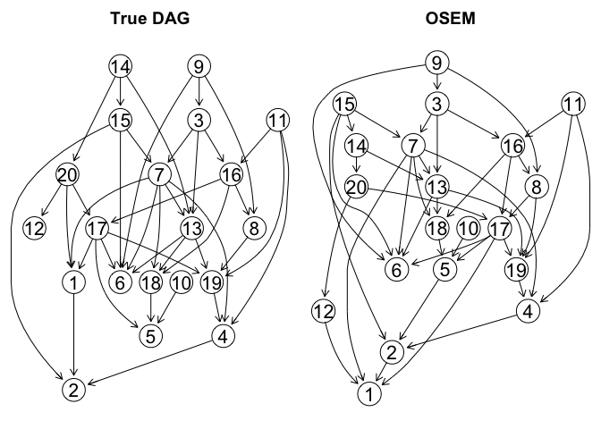
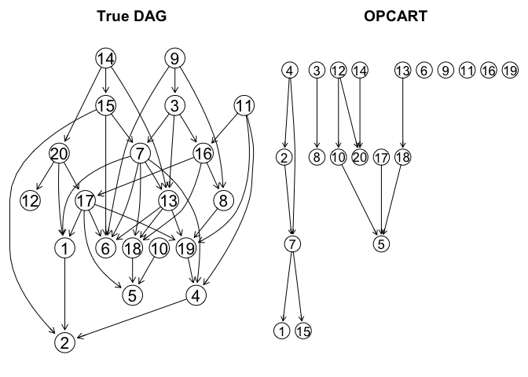

### 1. Load necessary packages and source code

``` r
library(BiDAG)
library(Rgraphviz)
library(pcalg)
library(graph)
library(bnlearn)
library(MXM)
library(sbgcop)
library(infotheo)
library(rpcart)
library(devtools)
source_url("https://raw.githubusercontent.com/cuiruifei/CausalMissingValues/master/R/inferCopulaModel.R")
```

``` r
setwd("../R")
# Major file containing the OSEM algorithm
source("ordinalScore.R") 
# Modify some of the existing functions in the BiDAG package to accommodate our user-defined functions
insertSource("spacefns.R",package = "BiDAG")
insertSource("usrscorefns.R",package = "BiDAG")
insertSource("initpar.R",package = "BiDAG")
insertSource("scoreagainstdag.R",package = "BiDAG")
```

### 2. Generate DAGs and ordinal data

``` r
set.seed(222)
N <- 500
n <- 20

# Generate a regular DAG with 20 nodes with 4 number of neighbors
trueDAG <- randDAG(n = n, d = 4, method = "er", wFUN = list(mywFUN))

# Convert the Gaussian dataset into an ordinal dataset
ordinal_data <- generateOrdinal(N, n, trueDAG, exp_levels = 4, concent_param = 2)
ordinal_data_df <- as.data.frame(ordinal_data)
ordinal_data_df[] <- lapply(ordinal_data_df[], as.ordered)
ordinal_levels <- apply(ordinal_data, 2, function(x) length(unique(x)))
```

### 3. Learn the structures using different methods

The following simulations can be repeated many times for different
configurations of parameters in order to obtain the ROC curves.

-   NPC

``` r
# NPC algorithm with the G^2 test (significance level: 0.05)
NPCfit <- pc(suffStat = list(dm = ordinal_data, 
                             nlev = apply(ordinal_data, 2, function (x) length(unique(x))),
                             adaptDF = FALSE),
             alpha = 0.05,
             indepTest = disCItest,
             labels = colnames(ordinal_data))
```


``` r
# Compare the patterns between them
comparePatterns(NPCfit,trueDAG) # hard version
```

    ##       SHD        TP        FP        TN        FN Precision       TPR     FPR_N 
    ##     37.50      2.50      4.50    150.00     33.00      0.36      0.06      0.03 
    ##     FPR_P 
    ##      0.12

``` r
comparePatterns(NPCfit,trueDAG,hardP2P = FALSE) # soft version
```

    ##       SHD        TP        FP        TN        FN Precision       TPR     FPR_N 
    ##     37.50      2.50      4.50    150.00     33.00      0.36      0.06      0.03 
    ##     FPR_P 
    ##      0.12

-   OPC (Musella, 2013)

``` r
# OPC algorithm with the ordinal Jonckheere–Terpstra test (significance level: 0.05) (bnlearn implementation)
OPCfit <- amat(pc.stable(ordinal_data_df, alpha = 0.05, test = "jt"))
```



``` r
# Compare the patterns between them
comparePatterns(OPCfit,trueDAG) # hard version
```

    ##       SHD        TP        FP        TN        FN Precision       TPR     FPR_N 
    ##     28.00     14.00     17.00    148.00     11.00      0.45      0.36      0.11 
    ##     FPR_P 
    ##      0.44

``` r
comparePatterns(OPCfit,trueDAG,hardP2P = FALSE) #soft version
```

    ##       SHD        TP        FP        TN        FN Precision       TPR     FPR_N 
    ##     28.00     14.00     17.00    148.00     11.00      0.45      0.36      0.11 
    ##     FPR_P 
    ##      0.44

-   GPC

``` r
# GPC algorithm with the Gaussian test (significance level: 0.05)
GPCfit <- pc(suffStat = list(C = cor(ordinal_data), n = N),
             alpha = 0.05,
             indepTest = gaussCItest,
             labels = colnames(ordinal_data))
# # GPC algorithm (significance level: 0.05) (bnlearn implementation)
# GPCfit <- amat(pc.stable(as.data.frame(ordinal_data), alpha = 0.05, test = "zf"))
```


``` r
# Compare the patterns between them
comparePatterns(GPCfit,trueDAG) # hard version
```

    ##       SHD        TP        FP        TN        FN Precision       TPR     FPR_N 
    ##     30.00     13.00     21.00    147.00      9.00      0.38      0.33      0.14 
    ##     FPR_P 
    ##      0.54

``` r
comparePatterns(GPCfit,trueDAG,hardP2P = FALSE) # soft version
```

    ##       SHD        TP        FP        TN        FN Precision       TPR     FPR_N 
    ##     30.00     13.00     21.00    147.00      9.00      0.38      0.33      0.14 
    ##     FPR_P 
    ##      0.54

-   RPC (Harris and Drton, 2013; Cui et al., 2018)

``` r
corr.rank <- sin(pi/2 * cor(ordinal_data, use = 'pairwise.complete.obs', method = 'kendall'))
RPCfit <- pc(suffStat = list(C = corr.rank, n = N), 
             indepTest = gaussCItest, labels = colnames(ordinal_data), alpha = 0.05, conservative = T)
```



``` r
# Compare the patterns between them
comparePatterns(RPCfit,trueDAG) # hard version
```

    ##       SHD        TP        FP        TN        FN Precision       TPR     FPR_N 
    ##     17.00     23.00      8.00    150.00      9.00      0.74      0.59      0.05 
    ##     FPR_P 
    ##      0.21

``` r
comparePatterns(RPCfit,trueDAG,hardP2P = FALSE) # soft version
```

    ##       SHD        TP        FP        TN        FN Precision       TPR     FPR_N 
    ##     17.00     23.00      8.00    150.00      9.00      0.74      0.59      0.05 
    ##     FPR_P 
    ##      0.21

-   Copula PC (Cui et al., 2016, 2017, 2018)

``` r
# copula object
cop.obj <- inferCopulaModel(ordinal_data, nsamp = 1000, S0 = diag(n)/N, verb = F)
# correlation matrix samples
C_samples <- cop.obj$C.psamp[,, 501:1000]
# average correlation matrix
corr.cop <- apply(C_samples, c(1,2), mean)
# call the PC algorithm for causal discovery
CPCfit <- pc(suffStat = list(C = corr.cop, n = N), 
             indepTest = gaussCItest, labels = colnames(ordinal_data), alpha = 0.05, conservative = T)
```


``` r
# Compare the patterns between them
comparePatterns(CPCfit,trueDAG) # hard version
```

    ##       SHD        TP        FP        TN        FN Precision       TPR     FPR_N 
    ##     20.50     21.50     10.50    148.00     10.00      0.67      0.55      0.07 
    ##     FPR_P 
    ##      0.27

``` r
comparePatterns(CPCfit,trueDAG,hardP2P = FALSE) # soft version
```

    ##       SHD        TP        FP        TN        FN Precision       TPR     FPR_N 
    ##     20.50     21.50     10.50    148.00     10.00      0.67      0.55      0.07 
    ##     FPR_P 
    ##      0.27

-   MMPC (Tsagris et al., 2018)

``` r
skel <- pc.skel(ordinal_data_df, method = "comb.mm", alpha = 0.05)
MMDAG <- pc.or(skel)$G
MMDAG[MMDAG == 2] <- 1
MMDAG[MMDAG == 3] <- 0
```


``` r
# Compare the patterns between them
comparePatterns(MMDAG,trueDAG) # hard version
```

    ##       SHD        TP        FP        TN        FN Precision       TPR     FPR_N 
    ##     25.00     16.00     13.00    149.00     12.00      0.55      0.41      0.09 
    ##     FPR_P 
    ##      0.33

``` r
comparePatterns(MMDAG,trueDAG,hardP2P = FALSE) # soft version
```

    ##       SHD        TP        FP        TN        FN Precision       TPR     FPR_N 
    ##     25.00     16.00     13.00    149.00     12.00      0.55      0.41      0.09 
    ##     FPR_P 
    ##      0.33

-   BDe (Heckerman and Geiger, 1995)

``` r
# hybrid method with the BDe score and the nominal PC output as the initial search space
BDE <- scoreparameters("bdecat",data.frame(ordinal_data),bdecatpar = list(chi = 0.5))
BDEfit <- iterativeMCMC(BDE)
```


``` r
# Compare the patterns between them
comparePatterns(as.matrix(BDEfit$DAG),trueDAG) # hard version
```

    ##       SHD        TP        FP        TN        FN Precision       TPR     FPR_N 
    ##     26.50     12.50      7.50    151.00     19.00      0.62      0.32      0.05 
    ##     FPR_P 
    ##      0.19

``` r
comparePatterns(as.matrix(BDEfit$DAG),trueDAG,hardP2P = FALSE) # soft version
```

    ##       SHD        TP        FP        TN        FN Precision       TPR     FPR_N 
    ##     26.50     12.50      7.50    151.00     19.00      0.62      0.32      0.05 
    ##     FPR_P 
    ##      0.19

-   BGe (Heckerman and Geiger, 1995)

``` r
# hybrid method with the BGe score and the Gaussian PC output as the initial search space
BGE <- scoreparameters("bge", ordinal_data, bgepar = list(am = 0.5))
BGEfit <- iterativeMCMC(BGE,scoreout = TRUE)
```


``` r
# Compare the patterns between them
comparePatterns(as.matrix(BGEfit$DAG),trueDAG) # hard version
```

    ##       SHD        TP        FP        TN        FN Precision       TPR     FPR_N 
    ##     15.00     34.00     12.00    141.00      3.00      0.74      0.87      0.08 
    ##     FPR_P 
    ##      0.31

``` r
comparePatterns(as.matrix(BGEfit$DAG),trueDAG,hardP2P = FALSE) # soft version
```

    ##       SHD        TP        FP        TN        FN Precision       TPR     FPR_N 
    ##     15.00     34.00     12.00    141.00      3.00      0.74      0.87      0.08 
    ##     FPR_P 
    ##      0.31

-   OSEM

``` r
# the OSEM algorithm
OSEMfit <- ordinalStructEM(n, ordinal_data,
                           usrpar = list(penType = "other",
                                         L = 5,
                                         lambda = 3,
                                         preLevels = NULL))
```



``` r
# Compare the patterns between them
comparePatterns(as.matrix(OSEMfit$DAG),trueDAG) # hard version
```

    ##       SHD        TP        FP        TN        FN Precision       TPR     FPR_N 
    ##      5.00     37.00      4.00    148.00      1.00      0.90      0.95      0.03 
    ##     FPR_P 
    ##      0.10

``` r
comparePatterns(as.matrix(OSEMfit$DAG),trueDAG,hardP2P = FALSE) # soft version
```

    ##       SHD        TP        FP        TN        FN Precision       TPR     FPR_N 
    ##      5.00     37.00      4.00    148.00      1.00      0.90      0.95      0.03 
    ##     FPR_P 
    ##      0.10

-   PCART (Talvitie et al., 2019)

``` r
setwd("../R")
insertSource("usrscorefns_pcart.R",package = "BiDAG")
```

``` r
pcartparam <- scoreparameters("usr", ordinal_data_df, 
                              usrpar = list(pcart_alpha = 1.5,
                                            pcart_kappa = 0.25,
                                            pctesttype = "bde", 
                                            preLevels = ordinal_levels,
                                            response_type = "CAT"))
# need to set limit to the parent set size due to computational limit
pcartfit <- iterativeMCMC(pcartparam, alpha = 0, plus1it = 10, softlimit = 3, hardlimit = 3)
```

    ## maximum parent set size is 0 
    ## core space defined, score table are being computed 
    ## score tables completed, iterative MCMC is running 
    ## search space expansion 2 
    ## search space expansion 3 
    ## search space expansion 4 
    ## search space expansion 5


``` r
# Compare the patterns between them
comparePatterns(as.matrix(pcartfit$DAG),trueDAG) # hard version
```

    ##       SHD        TP        FP        TN        FN Precision       TPR     FPR_N 
    ##     27.50     16.50     15.50    146.00     12.00      0.52      0.42      0.10 
    ##     FPR_P 
    ##      0.40

``` r
comparePatterns(as.matrix(pcartfit$DAG),trueDAG,hardP2P = FALSE) # soft version
```

    ##       SHD        TP        FP        TN        FN Precision       TPR     FPR_N 
    ##     27.50     16.50     15.50    146.00     12.00      0.52      0.42      0.10 
    ##     FPR_P 
    ##      0.40

-   OPCART (Talvitie et al., 2019)

``` r
opcartparam <- scoreparameters("usr", ordinal_data_df, 
                              usrpar = list(pcart_alpha = 1.5,
                                            pcart_kappa = 0.25,
                                            pctesttype = "bde", 
                                            preLevels = ordinal_levels,
                                            response_type = "ORD"))
# need to set limit to the parent set size due to computational limit
opcartfit <- iterativeMCMC(opcartparam, alpha = 0, plus1it = 10, softlimit = 3, hardlimit = 3)
```

    ## maximum parent set size is 0 
    ## core space defined, score table are being computed 
    ## score tables completed, iterative MCMC is running 
    ## search space expansion 2 
    ## search space expansion 3 
    ## search space expansion 4



``` r
# Compare the patterns between them
comparePatterns(as.matrix(opcartfit$DAG),trueDAG) # hard version
```

    ##       SHD        TP        FP        TN        FN Precision       TPR     FPR_N 
    ##     35.50      6.50      6.50    148.00     29.00      0.50      0.17      0.04 
    ##     FPR_P 
    ##      0.17

``` r
comparePatterns(as.matrix(opcartfit$DAG),trueDAG,hardP2P = FALSE) # soft version
```

    ##       SHD        TP        FP        TN        FN Precision       TPR     FPR_N 
    ##     35.50      6.50      6.50    148.00     29.00      0.50      0.17      0.04 
    ##     FPR_P 
    ##      0.17
