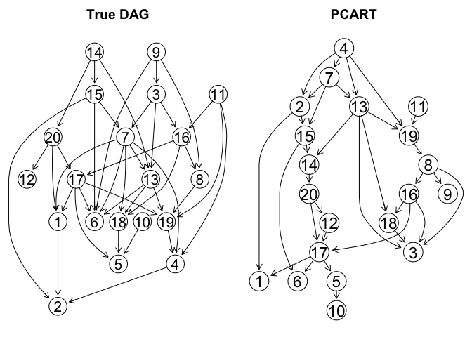

This file demonstrates the simulations part of my Master thesis -
“Learning Bayesian Networks from Ordinal Data”.

### 1. Load necessary packages and source code

``` r
library(BiDAG)
library(Rgraphviz)
library(pcalg)
```

``` r
setwd("../R")
# Major file containing the OSEM algorithm
source("ordinalScore.R") 
# Modify some of the existing functions in the BiDAG package to accommodate our user-defined functions
insertSource("spacefns.R",package = "BiDAG")
insertSource("usrscorefns.R",package = "BiDAG")
```

### 2. Other functions

``` r
##' rmvDAG2(N, randDAGobj): 
##' a function that does the same thing as the pcalg::rmvDAG function
##' but the input DAG is not necessarily topologically ordered
##' @param N: number of samples to be drawn
##' @param randDAGobj: a graph object generated from the pcalg::randDAG function
##' @return a Gaussian dataset
rmvDAG2 <- function(N, randDAGobj) {
  AM <- as(randDAGobj, "matrix")
  sorted_ind <- ggm::topOrder((AM != 0))
  n <- nrow(AM)
  data <- matrix(nrow = N,ncol = n)
  for (j in sorted_ind) {
    parentnodes <- which(AM[,j] != 0)
    lp <- length(parentnodes)
    switch (as.character(lp),
            "0" = {data[,j] <- rnorm(N)},
            "1" = {data[,j] <- rnorm(N, mean = data[,parentnodes] * AM[parentnodes,j], sd = 1)},
            {data[,j] <- rnorm(N, mean = data[,parentnodes] %*% AM[parentnodes,j], sd = 1)}
    )
  }
  return(data)
}
```

``` r
##' cutfun(L, c): 
##' a function that simulates the cell probabilities from a symmetric Dirichlet distribution
##' @param L: number of ordinal levels
##' @param c: Dirichlet concentration parameter
##' @return a list of probabilities of length L, summing up to 1
cutfun <- function(L,c) {
  p <- gtools::rdirichlet(1,rep(c,L))
  return(qnorm(cumsum(p)[1:(L-1)]))
}
```

``` r
##' convertToOrdinal(scaled_data, exp_levels, concent_param): 
##' a function that converts standardized Gaussian data into ordinal data
##' @param scaled_data: Gaussian dataset with each dimension standardized
##' @param exp_levels: expected number of ordinal levels
##' @param concent_param: Dirichlet concentration parameter
##' @return an ordinal dataset
convertToOrdinal <- function(scaled_data, exp_levels = 4,concent_param = 2) {
  n <- ncol(scaled_data)
  if (exp_levels == 2) {
    ordinal_levels <- replicate(n,2)
  } else {
    ordinal_levels <- replicate(n,sample(c(2:(2 * exp_levels - 2)),1))
  }
  ordinal_data <- scaled_data
  for (i in c(1:n)) {
    
    check_levels <- ordinal_levels[i] - 1
    while (check_levels != ordinal_levels[i]) {
      cuts <- c(-Inf, 
                cutfun(ordinal_levels[i],concent_param), 
                Inf)
      temp <- cut(scaled_data[,i], simplify2array(cuts), labels = FALSE) - 1
      check_levels <- length(unique(temp))
    }
    ordinal_data[,i] <- temp
    
  }
  colnames(ordinal_data) <- c(1:n)
  return(ordinal_data)
}
```

``` r
##' catCItest(x, y, S, suffStat): 
##' a helper function for categorical tests to be consumed by the pcalg::pc function
##' @param x,y,S: position of variable X, Y and set of variables S, respectively, in the adjacency matrix
##' @param suffStat: sufficient statistics for the test
##' @return p-value of the categorical tests
catCItest <- function(x, y, S, suffStat) {
  return(gRim::ciTest_ordinal(data.frame(apply(suffStat$data,2,factor)),
                              set = as.numeric(c(x,y,S)),
                              statistic = suffStat$stat_type)$P)
}
```

``` r
##' mywFUN(m): 
##' a function that samples the edge weights uniformly from the interval (-1,-0.4) U (0.4,1)
##' @param m: number of edges in the DAG
##' @return m edge weights
mywFUN <- function(m) {
  return(replicate(m,mywFUNhelper()))
}
mywFUNhelper <- function() {
  y <- runif(1, 0, 1.2)
  if( y < 0.6 ){
    x <- -1 + y
  }else{
    x <- 0.4 + y - 0.6
  }
  return(x)
}
```

### 3. Generate DAGs and ordinal data

``` r
set.seed(888)
# Generate a regular DAG with 20 nodes with 4 number of neighbors
n <- 20
trueDAG <- randDAG(n = n, d = 4, method = "power", wFUN = list(mywFUN))

# Generate a Gaussian dataset based on the DAG and standardize each dimension
# Sample size = 500
N <- 500
hidden_data <- rmvDAG2(N, trueDAG)
truecov <- trueCov(trueDAG)
D <- diag(sqrt(diag(truecov)))
D.inv <- chol2inv(chol(D))
trueSigma <- D.inv %*% truecov %*% D.inv
scaled_data <- t(D.inv %*% t(hidden_data))

# Convert the Gaussian dataset into an ordinal dataset
ordinal_data <- convertToOrdinal(scaled_data, exp_levels = 4,concent_param = 2)
```

### 4. Learn the structures using different methods

The following simulations can be repeated many times for different
configurations of parameters in order to obtain the ROC curves.

``` r
# NPC algorithm with the nominal deviance test (significance level: 0.05)
NPCfit <- pc(suffStat = list(data = ordinal_data, stat_type = "dev"),
             alpha = 0.05,
             indepTest = catCItest,
             labels = colnames(ordinal_data))
```


``` r
# Compare the patterns between them
comparePatterns(NPCfit,trueDAG) # hard version
```

    ##          SHD           TP           FP           TN           FN    Precision 
    ##  22.00000000   7.00000000   7.00000000 161.00000000  15.00000000   0.50000000 
    ##          TPR        FPR_N        FPR_P 
    ##   0.28000000   0.04242424   0.28000000

``` r
comparePatterns(NPCfit,trueDAG,hardP2P = FALSE) # soft version
```

    ##          SHD           TP           FP           TN           FN    Precision 
    ##  20.50000000   8.50000000   5.50000000 161.00000000  15.00000000   0.60714286 
    ##          TPR        FPR_N        FPR_P 
    ##   0.34000000   0.03333333   0.22000000

``` r
# OPC algorithm with the ordinal Jonckheere–Terpstra test (significance level: 0.05)
OPCfit <- pc(suffStat = list(data = ordinal_data, stat_type = "jt"),
             alpha = 0.05,
             indepTest = catCItest,
             labels = colnames(ordinal_data))
```


``` r
# Compare the patterns between them
comparePatterns(OPCfit,trueDAG) # hard version
```

    ##          SHD           TP           FP           TN           FN    Precision 
    ## 2.500000e+01 1.000000e+00 1.000000e+00 1.640000e+02 2.400000e+01 5.000000e-01 
    ##          TPR        FPR_N        FPR_P 
    ## 4.000000e-02 6.060606e-03 4.000000e-02

``` r
comparePatterns(OPCfit,trueDAG,hardP2P = FALSE) #soft version
```

    ##          SHD           TP           FP           TN           FN    Precision 
    ## 2.500000e+01 1.000000e+00 1.000000e+00 1.640000e+02 2.400000e+01 5.000000e-01 
    ##          TPR        FPR_N        FPR_P 
    ## 4.000000e-02 6.060606e-03 4.000000e-02

``` r
# GPC algorithm with the Gaussian test (significance level: 0.05)
GPCfit <- pc(suffStat = list(C = cor(ordinal_data), n = N),
             alpha = 0.05,
             indepTest = gaussCItest,
             labels = colnames(ordinal_data))
```


``` r
# Compare the patterns between them
comparePatterns(GPCfit,trueDAG) # hard version
```

    ##         SHD          TP          FP          TN          FN   Precision 
    ##  29.0000000   9.0000000  21.0000000 152.0000000   8.0000000   0.3000000 
    ##         TPR       FPR_N       FPR_P 
    ##   0.3600000   0.1272727   0.8400000

``` r
comparePatterns(GPCfit,trueDAG,hardP2P = FALSE) # soft version
```

    ##         SHD          TP          FP          TN          FN   Precision 
    ##  25.5000000  12.5000000  17.5000000 152.0000000   8.0000000   0.4166667 
    ##         TPR       FPR_N       FPR_P 
    ##   0.5000000   0.1060606   0.7000000

``` r
# hybrid method with the BDe score and the nominal PC output as the initial search space
BDE <- scoreparameters(n,"bdecat",data.frame(ordinal_data),bdecatpar = list(chi = 0.5))
BDEfit <- iterativeMCMC(BDE)
```


``` r
# Compare the patterns between them
comparePatterns(BDEfit$max$DAG,trueDAG) # hard version
```

    ##          SHD           TP           FP           TN           FN    Precision 
    ##  13.00000000  12.00000000   6.00000000 165.00000000   7.00000000   0.66666667 
    ##          TPR        FPR_N        FPR_P 
    ##   0.48000000   0.03636364   0.24000000

``` r
comparePatterns(BDEfit$max$DAG,trueDAG,hardP2P = FALSE) # soft version
```

    ##          SHD           TP           FP           TN           FN    Precision 
    ##  10.00000000  15.00000000   3.00000000 165.00000000   7.00000000   0.83333333 
    ##          TPR        FPR_N        FPR_P 
    ##   0.60000000   0.01818182   0.12000000

``` r
# hybrid method with the BGe score and the Gaussian PC output as the initial search space
BGE <- scoreparameters(n, "bge", ordinal_data,bgepar = list(am = 0.5))
BGEfit <- iterativeMCMC(BGE,scoreout = TRUE)
```



``` r
# Compare the patterns between them
comparePatterns(BGEfit$max$DAG,trueDAG) # hard version
```

    ##          SHD           TP           FP           TN           FN    Precision 
    ##  16.00000000  20.00000000  13.00000000 154.00000000   3.00000000   0.60606061 
    ##          TPR        FPR_N        FPR_P 
    ##   0.80000000   0.07878788   0.52000000

``` r
comparePatterns(BGEfit$max$DAG,trueDAG,hardP2P = FALSE) # soft version
```

    ##          SHD           TP           FP           TN           FN    Precision 
    ##  15.50000000  20.50000000  12.50000000 154.00000000   3.00000000   0.62121212 
    ##          TPR        FPR_N        FPR_P 
    ##   0.82000000   0.07575758   0.50000000

``` r
# the OSEM algorithm
OSEMfit <- ordinalStructEM(n, ordinal_data,
                           usrpar = list(penType = "other",
                                         L = 5,
                                         lambda = 3))
```


``` r
# Compare the patterns between them
comparePatterns(OSEMfit$max$DAG,trueDAG) # hard version
```

    ##          SHD           TP           FP           TN           FN    Precision 
    ##   6.00000000  23.00000000   5.00000000 161.00000000   1.00000000   0.82142857 
    ##          TPR        FPR_N        FPR_P 
    ##   0.92000000   0.03030303   0.20000000

``` r
comparePatterns(OSEMfit$max$DAG,trueDAG,hardP2P = FALSE) # soft version
```

    ##          SHD           TP           FP           TN           FN    Precision 
    ##   5.50000000  23.50000000   4.50000000 161.00000000   1.00000000   0.83928571 
    ##          TPR        FPR_N        FPR_P 
    ##   0.94000000   0.02727273   0.18000000
